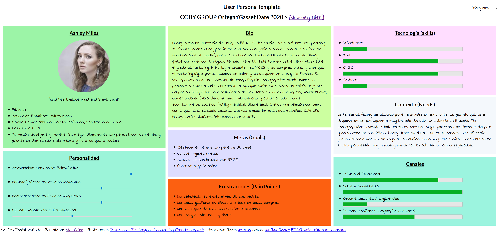
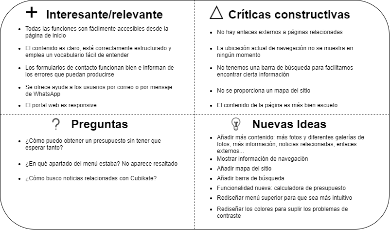
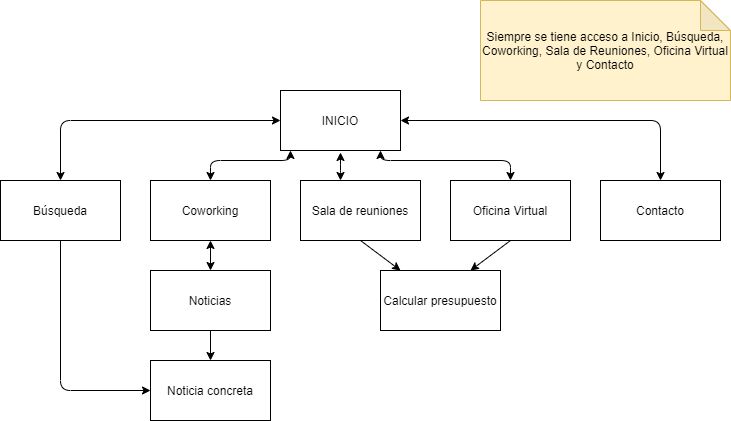
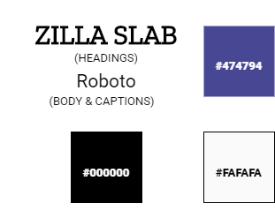
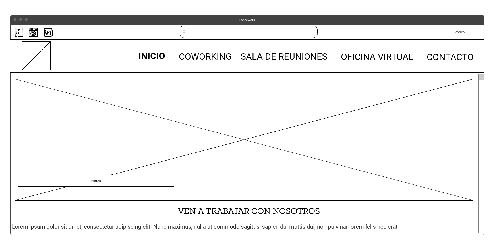
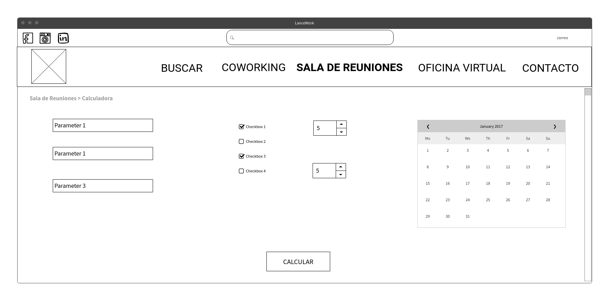

# DIU20_UX_Coworking
 Trabajo Final - Análisis y rediseño de un caso práctico 

Caso de estudio: [Cubikate Granada](https://cubikate.es/)

Proyecto de rediseño: LanceWork

Descripción: LanceWork es un portal web destinado a publicitar oficinas de coworking en pleno centro de Granada. A través de esta web podrás consultar toda la información relacionada con nosotros, ver el entorno de trabajo, realizar presupuestos y organizar visitas guiadas de una manera sencilla y atractiva.

Autor: [Marina Hernández Bautista](http://github.com/marinahbau)    :octocat:     

----- 

En este documento realizaremos un proceso de diseño acotado y simplificado para elaborar un proyecto que redefina y mejore al caso de estudio propuesto en un período reducido de tiempo. Para ello, se pondrán en práctica técnicas y herramientas UX ya estudiadas en la asignatura.

# Proceso de Análisis 

Empezamos el proceso de análisis, describiendo las competencias principales de Cubikate y estableciendo qué herramientas vamos a utilizar para analizarla en profundidad.

## Primeras Herramientas UX. Análisis Básico.

Para este primer análisis haremos una pequeña descripción de la funcionalidad y diseño de la web, reutilizaremos una persona y, para cerrar esta primera vuelta, realizaremos un Usability Review que saque a la luz los puntos fuertes y débiles del diseño.

### 1. Descripción del supuesto práctico

>>> Breve análisis de Cubikate

Cubikate es un portal web para publicitar unas oficinas de coworking en el centro de Granada. En este lugar se reúnen trabajadores de distintos sectores y empresas con el objetivo de conseguir un lugar tranquilo de trabajo, así como nuevas oportunidades de negocio y ampliaciones en sus redes de contactos.

El portal web ofrece **información básica** sobre las oficinas Cubikate, sus instalaciones y los servicios que ofrece, así como un espacio para resolver dudas y **contactar con las oficinas** para planificar visitas guiadas.

### 2. Persona

>>> Reutilización de una persona

Esta persona es la primera herramienta que vamos a plantear para el proyecto de rediseño. Se va a reutilizar a una persona ya desarrollada en las prácticas de la asignatura. Esta persona ha sido **diseñada, revisada y verificada**, por lo que se trata de una herramienta que no está enfocada a un proyecto concreto. Es por eso que reutilizamos a Ashley Miles como posible usuario del portal web y que sirva de ayuda para buscar posibles faltas en el servicio.

### 3. Usability Review

>>>  Revisión de usabilidad

Pasamos un documento checklist para detectar fallos en las características de diseño más destacables de la web. El documento completo junto con explicaciones más específicas puedes verlo [aquí](doc/Usability-review-Cubikate.pdf)

Puntuación obtenida: 81 (BUENO)

Conclusión: Cubikate es un portal web que tiene poco contenido, por lo que su principal ventaja es la **accesibilidad de manera sencilla a las distintas funcionalidades del portal y la facilidad de uso general**.
Que la web tenga poco contenido supone un punto crítico: se echa de menos una ayuda en línea para el usuario, un mapa del sitio y procesos de trabajo adicionales como calculadoras de presupuesto, comentarios y más contenido multimedia para atraer a más clientes.

## Ánalisis más exhaustivo. Evaluación de Accesibilidad. 

Realizaremos un análisis de accesibilidad para examinar de manera profunda carencias en el diseño que luego podamos redefinir.

### 1. Documento de accesibilidad 

>>> Informe de accesibilidad

Evaluamos aspectos diferentes relacionados con la accesibilidad y encontramos muchos errores que no siguen las pautas WCAG y dificultades para navegar adecuadamente sin archivos CSS o JS. Estas características serán rediseñadas en el nuevo proyecto.
Puedes ver el informe completo [aquí](doc/Accesibilidad_Cubikate.pdf).

# Proceso de Diseño

En esta segunda mitad comenzaremos estableciendo las bases de nuestra nueva propuesta de valor y terminaremos con los prototipos necesarios para que todas las partes interesadas en el proyecto puedan hacerse una idea del resultado de este proceso de rediseño.

## Comienza el proceso de rediseño. 

Aquí sacaremos a la luz los puntos que van a hacer de nuestro proyecto de rediseño una alternativa al uso de Cubikate, salvando sus puntos críticos y aunando sus buenas prácticas en el diseño.

### 1. Feedback Capture Grid

>>> Nueva propuesta de valor

Agrupamos puntos fuertes y débiles y utilizamos a nuestra persona Ashley Miles para conseguir preguntas a partir de la experiencia. Obtenemos una serie de nuevas ideas que resumimos a modo de conclusión.

  
Conclusión: la nueva propuesta de valor, llamada **LanceWork** tendrá dos puntos fuertes a considerar.

- **El rediseño:** nuevo diseño del menú principal para resaltarlo y marcar la opción actual, así como rediseño de los colores para solucionar los problemas de accesibilidad relacionados con el contraste. Se añade también más contenido a la web: noticias, más fotos y más información del sitio.

- **Nuevos items:** información de navegación, mapa del sitio, barra de búsqueda y un programa de calculadora de presupuesto inmediato.

### 2. Sitemap 

>>> Definir un nuevo mapa del sitio

Definiremos ahora el mapa del sitio, que no se incluye en Cubikate y que marcará una diferencia en nuestra propuesta de proyecto. No se va a realizar un labelling puesto que los términos van a ser los mismos que los ya utilizados en Cubikate.

## Prototipado final del proceso de diseño

### 1. Guidelines

>>> Rediseño de los colores y la tipografía

Realizamos un Style Guide para comprobar de forma visual el resultado del rediseño de las tipografías y resolvemos los problemas de contraste utilizando la herramienta online [ Contrast Checker](https://webaim.org/resources/contrastchecker/).

- Utilizamos la fuente [Zilla Slab](https://fonts.google.com/specimen/Zilla+Slab) para los títulos, por ser una fuente más expresiva.

- Utilizamos la fuente [Roboto](https://fonts.google.com/specimen/Roboto) para el cuerpo del texto, por ser una tipografía uniforme y clara

### 2. Wireframes

>>> Bocetos de algunas pantallas esenciales de LanceWork 

Se adjuntan bocetos con un buen nivel de detalle para mostrar las páginas de **Inicio** y **Calculadora de presupuesto**

# Conclusión 

Con LanceWork pretendemos llegar al mayor número de interesados posible, ofreciendo una propuesta de diseño mejorada y más funcional.

A través de todo este proceso de análisis y rediseño podremos comprobar cómo todos los fallos destacables han sido **corregidos, añadidos, o rediseñados** para obtener un nuevo portal web más atractivo y que proporcione más facilidades a los usuarios habituales y nuevos en la plataforma.

